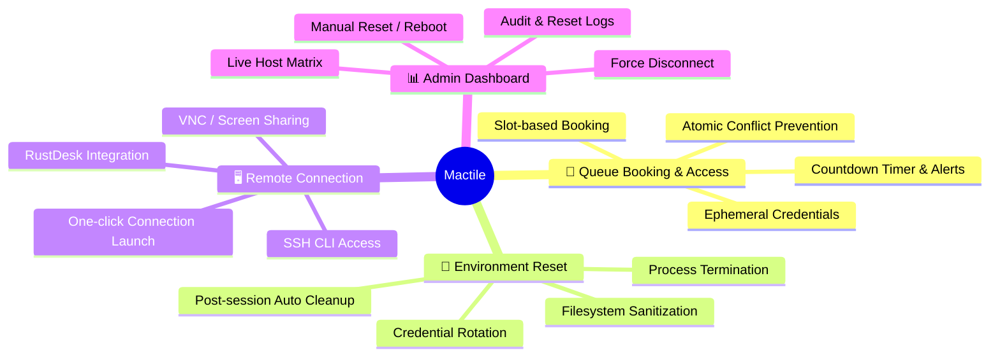
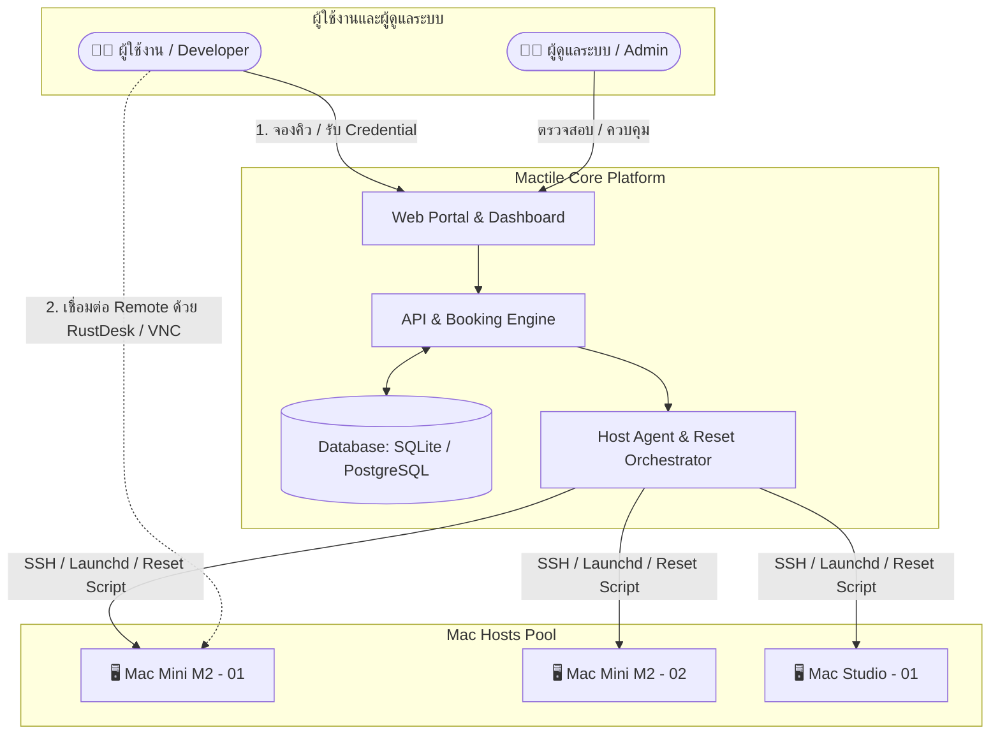

# 🍎 Mactile (Mactile)
> **Centralized Mac Resource Sharing & Automated Remote Lab Platform (MVP)**

[](https://github.com/)
[](https://apple.com/)
[](LICENSE)
[](#)

---

## 📖 บทนำ (Overview)

**Mactile** คือระบบบริหารจัดการและจัดสรรทรัพยากรเครื่อง Mac แบบรวมศูนย์ พัฒนาขึ้นเพื่อแก้ปัญหาการแย่งชิงทรัพยากรเครื่อง Mac สำหรับการพัฒนา การทดสอบ (Testing) และการ Build แอปพลิเคชัน (iOS/macOS) 

ระบบช่วยให้ผู้ใช้งานสามารถ **จองคิวล่วงหน้า**, **รับสิทธิ์และรหัสผ่านชั่วคราว**, **เชื่อมต่อรีโมทผ่านโปรแกรมสำเร็จรูป** และมีระบบ **คืนสภาพแวดล้อมเครื่อง (Automated Environment Reset)** อัตโนมัติหลังจบการใช้งาน พร้อมหน้าจอ **Admin Dashboard** สำหรับควบคุมและตรวจสอบสถานะแบบเรียลไทม์

---

## ✨ คุณสมบัติหลัก (Key Features)



### 1. 📅 ระบบจองคิวและการจัดการสิทธิ์ (Queue Booking & Access Management)
- **Time-Slot Booking:** เลือกรอบเวลาการใช้งานล่วงหน้า พร้อมระบบป้องกันการจองเวลาซ้อนกัน (Zero Double-Booking)
- **Ephemeral Credentials:** ออกรหัสผ่านชั่วคราวเฉพาะช่วงเวลาที่จอง และตัดสิทธิ์ทันทีเมื่อหมดรอบ
- **Active Session Timer:** แสดงเวลานับถอยหลัง พร้อมแจ้งเตือนเตือนล่วงหน้า 5 นาทีก่อนหมดเวลา

### 2. 🧹 ระบบจัดการและรีเซ็ตสภาพแวดล้อม (Automated Environment Reset)
- **Post-Session Cleanup:** ล้างไฟล์ใน `~/Desktop`, `~/Downloads`, `/tmp` และ `~/.Trash` อัตโนมัติ
- **Process Termination:** สั่งปิดโปรเซสตกค้าง เช่น Xcode, Simulator, Node.js, Docker
- **Credential & History Flush:** ล้างประวัติ Shell (`.zsh_history`), ล้างแคชเบราว์เซอร์ และเปลี่ยนรหัสผ่าน Remote
- **Fast Reset Cycle:** ทำความสะอาดเครื่องเสร็จสิ้นภายใน **< 60 วินาที**

### 3. 🖥️ การเชื่อมต่อรีโมทด้วยโปรแกรมสำเร็จรูป (Remote Connection via Existing Software)
- ไม่ต้องพัฒนาโปรแกรมรีโมทใหม่ รองรับโปรแกรมมาตรฐานยอดนิยม:
  - **RustDesk:** เชื่อมต่อง่ายผ่าน Remote ID และ One-time Password
  - **VNC / Apple Screen Sharing:** เชื่อมต่อผ่าน IP/Port ด้วย Native macOS Protocol
  - **SSH:** สำหรับการรันงานประเภท CLI / Build Script
- มีปุ่ม **One-Click Launch** และฟังก์ชันคัดลอกข้อมูลการเชื่อมต่อสะดวกรวดเร็ว

### 4. 📊 แดชบอร์ดสำหรับผู้ดูแลระบบ (Admin Dashboard & Control Center)
- **Live Host Matrix:** ติดตามสถานะเครื่องทุกเครื่องแบบเรียลไทม์ (🟢 `Available`, 🟡 `In-Use`, 🟠 `Resetting`, 🔴 `Maintenance/Offline`)
- **Emergency Controls:** ปุ่มสั่ง **Force Disconnect** ตัดการเชื่อมต่อผู้ใช้ทันที และปุ่มสั่ง **Manual Trigger Reset / Reboot**
- **Audit Trail & Reports:** บันทึกประวัติการจอง การเข้าใช้งานจริง และ Log การทำงานของสคริปต์รีเซ็ต

---

## 🏛️ สถาปัตยกรรมระบบ (System Architecture)



---

## 📚 เอกสารโครงการ (Project Documentation)

เอกสารข้อมูลโครงการฉบับเต็มทั้งหมดถูกจัดเก็บอยู่ในโฟลเดอร์ [`docs/`](file:///D:/6705100040/1_69/AG/LAB-DOC/docs):

| เอกสาร | รายละเอียด | ลิงก์ไฟล์ |
|---|---|---|
| **Project Charter** | วัตถุประสงค์ ขอบเขตโครงการ แผนการดำเนินงาน และความเสี่ยง | [docs/project_charter.md](file:///D:/6705100040/1_69/AG/LAB-DOC/docs/project_charter.md) |
| **Software Requirements Specification (SRS)** | ข้อกำหนดเชิงฟังก์ชัน (FR), ข้อกำหนดเชิงคุณภาพ (NFR), Data Model และ Sequence Workflow | [docs/requirements_specification.md](file:///D:/6705100040/1_69/AG/LAB-DOC/docs/requirements_specification.md) |
| **Acceptance Criteria & UAT** | เกณฑ์การตรวจรับระบบตามรูปแบบ BDD (Given-When-Then), ตารางเมทริกซ์ทดสอบ UAT และเกณฑ์ DoD | [docs/acceptance_criteria.md](file:///D:/6705100040/1_69/AG/LAB-DOC/docs/acceptance_criteria.md) |
| **Database Design** | แผนภาพ ERD, พจนานุกรมข้อมูล 7 ตาราง, DDL Schema Script และข้อมูล Seed Data | [docs/database_design.md](file:///D:/6705100040/1_69/AG/LAB-DOC/docs/database_design.md) |

---

## 📁 โครงสร้างโปรเจกต์ (Directory Structure)

```text
LAB-DOC/
├── docs/                               # เอกสารข้อกำหนดและการออกแบบระบบ
│   ├── project_charter.md              # กฎบัตรโครงการและขอบเขต MVP
│   ├── requirements_specification.md   # ข้อกำหนดความต้องการของระบบ (SRS)
│   ├── acceptance_criteria.md          # เกณฑ์การตรวจรับและ UAT Matrix
│   └── database_design.md              # การออกแบบฐานข้อมูลและ DDL Script
├── scripts/                            # Automation & Reset Scripts (macOS)
│   ├── reset_environment.sh            # สคริปต์ล้างสภาพแวดล้อมเครื่อง
│   └── rotate_password.sh              # สคริปต์สุ่มรหัสผ่าน Remote ชั่วคราว
├── src/                                # Source code ของระบบ Web & API
│   ├── backend/                        # Server API, Scheduler, Orchestrator
│   └── frontend/                       # Web Portal & Admin Dashboard
└── README.md                           # ภาพรวมของโครงการ Mactile
```

---

## 🚀 การติดตั้งและเริ่มต้นใช้งาน (Quick Start)

### 1. ความต้องการของระบบ (Prerequisites)
- **Server:** Node.js 18+ หรือ Python 3.10+
- **Database:** SQLite 3 (Default สำหรับ MVP) หรือ PostgreSQL 15+
- **Mac Host:** เครื่อง Mac (macOS 13+) ติดตั้งโปรแกรม Remote (เช่น RustDesk Daemon หรือ VNC/Apple Screen Sharing)

### 2. เริ่มต้นฐานข้อมูล (Database Initialization)
รันสคริปต์ DDL ที่ระบุใน [docs/database_design.md](file:///D:/6705100040/1_69/AG/LAB-DOC/docs/database_design.md) เพื่อสร้างตารางและ Seed ข้อมูลเริ่มต้น:

```bash
# ตัวอย่างการสร้าง SQLite Database
sqlite3 cmactile.db < docs/database_design.sql
```

### 3. ข้อมูลบัญชีเริ่มต้นสำหรับการทดสอบ (Default Accounts)
- **ผู้ดูแลระบบ (Admin):** Username: `admin` | Password: `Admin@1234`
- **ผู้ใช้งานทั่วไป (User):** Username: `developer1` | Password: `User@1234`

---

## 🗺️ แผนการพัฒนาในอนาคต (Roadmap)

- [x] **ระยะที่ 1 (MVP Baseline):** จัดทำเอกสารข้อกำหนด สถาปัตยกรรม การออกแบบฐานข้อมูล และ UAT Criteria
- [ ] **ระยะที่ 2 (Core System Implementation):** พัฒนาระบบ Booking Engine, Admin Dashboard และ macOS Cleanup Script
- [ ] **ระยะที่ 3 (Remote & Agent Integration):** ทดสอบการส่งสิทธิ์และรันคำสั่งรีเซ็ตเครื่อง Mac จริง
- [ ] **ระยะที่ 4 (Extended Features):** รองรับ macOS VM Snapshot Virtualization, ระบบแจ้งเตือนผ่าน Slack/LINE Notify และ Single Sign-On (SSO / OAuth2)

---

## 📄 ลิขสิทธิ์ (License)

โครงการนี้เผยแพร่ภายใต้ลิขสิทธิ์ [MIT License](LICENSE)
