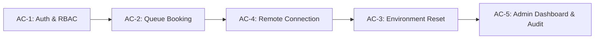

# เอกสารเกณฑ์การตรวจรับระบบ (Acceptance Criteria & UAT Checklist)
## โครงการ: Mactile
**เวอร์ชัน:** 1.0.0 (MVP)  
**วันที่จัดทำ:** 16 สิงหาคม 2026  
**สถานะ:** เอกสารเกณฑ์การตรวจรับระบบฉบับมาตรฐาน (UAT Baseline)

---

## 1. บทนำและแนวทางการตรวจรับ (Introduction & Testing Guidelines)

เอกสารฉบับนี้กำหนด **เกณฑ์การยอมรับ (Acceptance Criteria)** สำหรับโครงการ **Mactile (MVP)** โดยอ้างอิงตามข้อกำหนดใน [project_charter.md](file:///D:/6705100040/1_69/AG/LAB-DOC/docs/project_charter.md) และ [requirements_specification.md](file:///D:/6705100040/1_69/AG/LAB-DOC/docs/requirements_specification.md) 

เกณฑ์การตรวจรับเขียนขึ้นตามรูปแบบ **Behavior-Driven Development (BDD / Gherkin Style)**:
- **Given (กำหนดให้):** สถานะเริ่มต้นหรือเงื่อนไขตั้งต้นของระบบ
- **When (เมื่อเกิดเหตุการณ์):** การกระทำหรือขั้นตอนที่ผู้ใช้/ระบบกระทำ
- **Then (ผลลัพธ์ที่คาดหวัง):** พฤติกรรมและผลลัพธ์ที่ระบบต้องตอบสนองอย่างถูกต้อง

---

## 2. เกณฑ์การตรวจรับแยกตามฟังก์ชันหลัก (Feature Acceptance Criteria)

---

### หมวดที่ 1: การยืนยันตัวตนและการจัดการสิทธิ์ (Authentication & RBAC)

#### AC-1.1: การเข้าสู่ระบบของผู้ใช้ทั่วไป (User Authentication)
- **Given:** ผู้ใช้มีบัญชีที่ลงทะเบียนในระบบเรียบร้อยแล้ว
- **When:** ผู้ใช้กรอก Username/Password ที่ถูกต้องแล้วกดยืนยัน
- **Then:** 
  1. ระบบเข้าสู่ระบบสำเร็จและนำไปยังหน้า User Booking Portal
  2. แสดงชื่อผู้ใช้และเมนูที่เหมาะสมกับระดับ `USER`
  3. ไม่สามารถมองเห็นหรือคลิกเข้าลิงก์ Admin ได้

#### AC-1.2: การป้องกันการเข้าถึงส่วนผู้ดูแลระบบ (Admin Route Protection)
- **Given:** ผู้ใช้เข้าสู่ระบบด้วยสิทธิ์ `USER`
- **When:** ผู้ใช้พยายามพิมพ์ URL เพื่อเข้าหน้า Admin Dashboard (เช่น `/admin`) โดยตรง
- **Then:**
  1. ระบบต้องปฏิเสธการเข้าถึง (HTTP 403 Forbidden หรือ Redirect กลับหน้า Dashboard ทั่วไป)
  2. มีข้อความแจ้งเตือนว่า "คุณไม่มีสิทธิ์เข้าถึงส่วนนี้"

#### AC-1.3: การเข้าสู่ระบบของผู้ดูแลระบบ (Admin Authentication)
- **Given:** ผู้ใช้มีบัญชีสิทธิ์ `ADMIN`
- **When:** เข้าสู่ระบบสำเร็จ
- **Then:**
  1. ระบบนำทางไปยังหน้า **Admin Dashboard** โดยอัตโนมัติ
  2. แสดงเครื่องมือควบคุมสถานะเครื่อง Mac, ปุ่มสั่ง Reset, และตารางจัดการคิวทั้งหมด

---

### หมวดที่ 2: ระบบจองคิวและการเข้าถึง (Queue Booking & Access Management)

#### AC-2.1: การดูตารางและจองสล็อตเวลาว่าง (Slot Booking)
- **Given:** มีเครื่อง Mac Host สถานะ `Available` ในช่วงเวลา 13:00 - 14:00
- **When:** ผู้ใช้เลือกเครื่องและกดเลือกช่วงเวลา 13:00 - 14:00 แล้วกดยืนยันการจอง
- **Then:**
  1. ระบบบันทึกการจองลงฐานข้อมูล พร้อมเปลี่ยนสถานะสล็อตนั้นเป็น "Booked"
  2. แสดงรายการในแท็บ "My Bookings" ของผู้ใช้
  3. ผู้ใช้คนอื่นจะไม่สามารถเลือกช่วงเวลาดังกล่าวบนเครื่องเดียวกันได้

#### AC-2.2: การป้องกันการจองเวลาชนกัน (Concurrency & Double-Booking Prevention)
- **Given:** ผู้ใช้ A และผู้ใช้ B กำลังเปิดดูสล็อตเวลาเดียวกันที่ยังว่างอยู่พร้อมกัน
- **When:** ผู้ใช้ทั้งสองกดปุ่มยืนยันการจองในวินาทีเดียวกัน
- **Then:**
  1. ระบบต้องให้สิทธิ์ผู้ใช้คนแรกที่คำขอประมวลผลสำเร็จเพียงคนเดียว
  2. ผู้ใช้คนที่สองจะได้รับการแจ้งเตือนว่า "สล็อตเวลานี้ถูกจองไปแล้ว กรุณาเลือกช่วงเวลาอื่น"
  3. ต้องไม่มีข้อมูลการจองซ้ำซ้อน (Zero Double-Booking) ในฐานข้อมูล

#### AC-2.3: การรับข้อมูลการเชื่อมต่อเมื่อถึงเวลาเริ่มใช้งาน (Ephemeral Credential Delivery)
- **Given:** ผู้ใช้มีการจองในรอบเวลาปัจจุบัน (เช่น เวลาขณะนี้ 13:00)
- **When:** ผู้ใช้เปิดดูหน้า Session ของตนเอง
- **Then:**
  1. ระบบแสดงข้อมูลการเชื่อมต่อ: Host IP/Domain, Port, Remote ID และ **Temporary Password**
  2. แสดงเวลานับถอยหลัง (Countdown Timer) ตามเวลาที่เหลือของสล็อต
  3. มีปุ่มกด "Copy All" และปุ่ม Quick Link เปิดโปรแกรม Remote อัตโนมัติ

#### AC-2.4: การแจ้งเตือนก่อนหมดเวลาและตัดสิทธิ์อัตโนมัติ (Time Expiry & Auto-Release)
- **Given:** ผู้ใช้กำลังใช้งาน Session และเหลือเวลาอีก 5 นาที
- **When:** เวลาเดินทางมาถึงจุดเตือน (T - 5 นาที)
- **Then:** ระบบแสดง Notification หรือ Banner สีส้มเตือนว่า "Session ของคุณจะหมดลงใน 5 นาที"
- **When:** เวลาสิ้นสุดสล็อต (T = 0)
- **Then:**
  1. หน้าจอปิดการแสดงรหัสผ่าน
  2. ระบบส่งสัญญาณตัดการเชื่อมต่อ Remote Session
  3. ระบบเปลี่ยนสถานะ Host เป็น `Resetting` เพื่อเริ่มขั้นตอนทำความสะอาดเครื่อง

#### AC-2.5: การกดยุติการใช้งานก่อนเวลา (Early End Session)
- **Given:** ผู้ใช้ทำงานเสร็จก่อนหมดเวลาการจอง
- **When:** ผู้ใช้กดปุ่ม "End Session Early" และกดยืนยันในกล่องข้อความ
- **Then:**
  1. สิทธิ์การเข้าถึงของผู้ใช้จะถูกยกเลิกทันที
  2. ระบบเริ่มรันกระบวนการ Reset สภาพแวดล้อมทันทีโดยไม่ต้องรอให้หมดเวลาสล็อตเต็ม

---

### หมวดที่ 3: ระบบจัดการและรีเซ็ตสภาพแวดล้อมเครื่อง (Environment Management & Reset)

#### AC-3.1: การตัดการเชื่อมต่อและปิดโปรเซสตกค้าง (Process Termination)
- **Given:** ผู้ใช้สิ้นสุดการใช้งานโดยมีการเปิดแอปพลิเคชัน (เช่น Xcode, VS Code, Browser, Simulator หรือรัน Node Server) ค้างไว้
- **When:** ระบบสั่งรัน Automated Reset Script
- **Then:**
  1. Remote Daemon ทำการ Drop Session ของผู้ใช้ออกทันที
  2. Script ทำการ Kill User-level Processes ทั้งหมดที่รันภายใต้บัญชีผู้ใช้ทดสอบ

#### AC-3.2: การล้างโฟลเดอร์และไฟล์ชั่วคราว (Filesystem Sanitization)
- **Given:** มีการสร้างไฟล์ โฟลเดอร์ หรือดาวน์โหลดไฟล์ไว้ใน `~/Desktop`, `~/Downloads`, `/tmp`
- **When:** Reset Script ทำงาน
- **Then:**
  1. ไฟล์ทั้งหมดใน `~/Desktop/*`, `~/Downloads/*`, `~/.Trash/*` และ `/tmp/*` ถูกลบทิ้งทั้งหมด
  2. ไม่ปรากฏไฟล์ทดสอบของผู้ใช้คนก่อนหน้าเมื่อตรวจสอบหลังจากเสร็จสิ้น

#### AC-3.3: การล้างประวัติคำสั่งและข้อมูลประจำตัว (Credential & History Sanitization)
- **Given:** ผู้ใช้มีการล็อกอิน Git, พิมพ์คำสั่งบน Terminal หรือบันทึก Session บน Web Browser
- **When:** Reset Script ทำงาน
- **Then:**
  1. ไฟล์ประวัติ Shell History (`~/.zsh_history`, `~/.bash_history`) ถูกล้างเป็นค่าว่าง
  2. แคชและคุกกี้ของ Browser หลัก (Safari, Chrome) ถูกล้าง
  3. รหัสผ่านชั่วคราวของ Remote Service ถูกสุ่มใหม่ (Rotated)

#### AC-3.4: ระยะเวลาและความสมบูรณ์ของการรีเซ็ต (Reset Timing & Status Transition)
- **Given:** Host อยู่ในสถานะ `Resetting`
- **When:** Script ดำเนินการเสร็จสิ้นโดยไม่มีข้อผิดพลาด (Exit Code 0)
- **Then:**
  1. เวลาที่ใช้ทั้งหมดตั้งแต่เริ่มจนจบกระบวนการ Reset ต้อง **ไม่เกิน 60 วินาที**
  2. สถานะของ Host บน Dashboard เปลี่ยนกลับเป็น `Available` พร้อมรับคิวถัดไป
  3. บันทึกผลสำเร็จลงใน `RESET_LOG`

#### AC-3.5: การรับมือกรณีการรีเซ็ตล้มเหลว (Reset Failure Handling)
- **Given:** เกิดข้อผิดพลาดระหว่างรันสคริปต์ (เช่น Script Error หรือ Host ค้าง)
- **When:** กระบวนการ Reset ส่งค่า Exit Code != 0 หรือไม่ตอบสนองเกิน Timeout (90 วินาที)
- **Then:**
  1. ระบบปรับสถานะ Host เป็น `Maintenance` โดยอัตโนมัติ เพื่อไม่ให้ผู้ใช้คนถัดไปเข้าใช้งานเครื่องที่มีปัญหา
  2. ส่ง Alert แจ้งเตือนไปยัง Admin Dashboard ทันที

---

### หมวดที่ 4: การเชื่อมต่อรีโมทด้วยโปรแกรมสำเร็จรูป (Remote Connection Gateway)

#### AC-4.1: การเชื่อมต่อผ่านโปรแกรม RustDesk
- **Given:** ผู้ใช้ได้รับ Connection ID และ One-Time Password จากระบบ
- **When:** ผู้ใช้เปิดโปรแกรม RustDesk บนเครื่องของตนเอง กรอก Remote ID และ Password ที่ได้รับ
- **Then:**
  1. สามารถเชื่อมต่อหน้าจอ Mac Host ได้อย่างราบรื่น ภาพและเสียงแสดงผลถูกต้อง
  2. สามารถควบคุมเมาส์และคีย์บอร์ดได้ตามปกติ

#### AC-4.2: การเชื่อมต่อผ่านโปรแกรม VNC / Apple Screen Sharing
- **Given:** ผู้ใช้ได้รับ Host IP, VNC Port และ Temporary Password
- **When:** ผู้ใช้เปิดโปรแกรม VNC Viewer (หรือเปิดผ่าน Browser/macOS Screen Sharing)
- **Then:** สามารถเชื่อมต่อไปยังหน้าจอ Desktop ของ Mac Host ได้สำเร็จ

#### AC-4.3: การเชื่อมต่อผ่าน SSH สำหรับ Command-Line
- **Given:** ผู้ใช้ได้รับคำสั่ง SSH String เช่น `ssh testuser@host-ip -p 2222` พร้อมรหัสผ่าน
- **When:** ผู้ใช้รันคำสั่งบน Terminal
- **Then:** เข้าสู่ Shell บนเครื่อง Mac Host ได้สำเร็จภายในกรอบสิทธิ์ที่กำหนด

#### AC-4.4: การป้องกันการเชื่อมต่อหลังหมดเวลา (Post-Session Connection Rejection)
- **Given:** Session ของผู้ใช้สิ้นสุดลงแล้ว และรหัสผ่านถูกสับเปลี่ยนใหม่แล้ว
- **When:** ผู้ใช้พยายามใช้ Connection ID/IP และรหัสผ่านเดิมเพื่อเชื่อมต่อใหม่
- **Then:** โปรแกรม Remote ต้องปฏิเสธการเชื่อมต่อ (Authentication Failed) ไม่สามารถเข้าถึงเครื่องได้

---

### หมวดที่ 5: แดชบอร์ดสำหรับผู้ดูแลระบบ (Admin Dashboard & Control Center)

#### AC-5.1: การแสดงผลสถานะเครื่องแบบเรียลไทม์ (Live Host Matrix)
- **Given:** ผู้ดูแลระบบเปิดหน้า Admin Dashboard
- **When:** เครื่อง Mac แต่ละเครื่องมีการเปลี่ยนสถานะ (Available -> In-Use -> Resetting)
- **Then:**
  1. การ์ดของแต่ละเครื่องแสดง Badge สีตรงตามสถานะปัจจุบันอย่างถูกต้อง
  2. สำหรับเครื่องที่ `In-Use` ต้องแสดง Username ผู้ใช้งาน, เวลาเริ่มต้น และเวลานับถอยหลัง

#### AC-5.2: การตัดการเชื่อมต่อผู้ใช้ฉุกเฉิน (Force Disconnect)
- **Given:** มีเครื่องที่กำลังอยู่ในสถานะ `In-Use`
- **When:** Admin กดปุ่ม "Force Disconnect" บนการ์ดเครื่องนั้นและกดยืนยัน
- **Then:**
  1. Remote Session ของผู้ใช้ถูกตัดออกทันที
  2. ระบบสั่งเริ่มรัน Reset Script และเปลี่ยนสถานะเครื่องเป็น `Resetting`
  3. ระบบบันทึก Log ว่าการตัด Session เกิดจากคำสั่งของผู้ดูแลระบบ

#### AC-5.3: การสั่ง Manual Reset หรือ Reboot เครื่อง Mac
- **Given:** เครื่อง Mac อยู่ในสถานะใดๆ ที่ต้องการล้างเครื่องใหม่
- **When:** Admin กดปุ่ม "Trigger Reset" หรือ "Reboot Host"
- **Then:**
  1. ระบบส่งคำสั่งไปยัง macOS Host เพื่อรันสคริปต์หรือรีบูตเครื่อง
  2. สถานะบนหน้า Dashboard แสดงเป็น `Resetting` หรือ `Maintenance` ระหว่างดำเนินการ
  3. เมื่อดำเนินการเสร็จสิ้น สถานะจะกลับเป็น `Available` โดยอัตโนมัติ

#### AC-5.4: การตรวจสอบประวัติการใช้งานและ Logs (Audit Trail)
- **Given:** มีการใช้งานและการรีเซ็ตเกิดขึ้นในระบบ
- **When:** Admin เข้าสู่แท็บ "Audit Logs"
- **Then:**
  1. แสดงตารางประวัติเรียงตามวันเวลาล่าสุด (Timestamp, Host, User, Event Type, Status)
  2. สามารถคลิกดูรายละเอียด Output ของ Reset Script แต่ละครั้งได้

---

## 3. เกณฑ์การตรวจรับด้านคุณภาพและประสิทธิภาพ (Non-Functional Acceptance Criteria)

| รหัส | หัวข้อ | เกณฑ์การยอมรับ (Acceptance Criteria) | วิธีการทดสอบ |
|---|---|---|---|
| **NFR-AC1** | **Data Isolation** | ตรวจสอบว่าไม่มีไฟล์ โทเค็น หรือประวัติคำสั่งของผู้ใช้ตกค้างหลัง Reset | สุ่มสร้างไฟล์ทดสอบและตรวจสอบ Filesystem หลังจบรอบ |
| **NFR-AC2** | **Reset Speed** | ระยะเวลาเฉลี่ยของกระบวนการ Basic Reset ต้องต่ำกว่า 60 วินาที | จับเวลาการทำงานของ Reset Script จำนวน 10 รอบ |
| **NFR-AC3** | **API Latency** | หน้าเว็บและ API มีค่าเฉลี่ย Response Time < 500ms บนเครือข่ายทดสอบ | ใช้ Network Tab / Performance Test วัดค่า 95th Percentile |
| **NFR-AC4** | **Zero Double-Booking** | ไม่เกิดกรณีผู้ใช้ 2 คนจองช่วงเวลาเดียวกันบนเครื่องเดียวกันได้สำเร็จ | ทดสอบจำลองคำขอพร้อมกัน (Concurrent Load Test 20 Requests) |
| **NFR-AC5** | **Responsive Design** | หน้า Booking และ Dashboard จัดวางเลย์เอาต์สวยงาม ใช้งานได้ทั้งบน Desktop และ Mobile | ทดสอบบน Chrome, Safari, Edge และ Mobile Viewport |

---

## 4. ตารางเมทริกซ์การทดสอบระบบ (UAT Execution Matrix)

| Test ID | โมดูล | กรณีทดสอบ (Test Scenario) | ผลลัพธ์ที่คาดหวัง | ผลการทดสอบ (Pass/Fail) | ผู้ทดสอบ / วันที่ |
|:---:|---|---|---|:---:|:---:|
| **TC-01** | Auth | ตรวจสอบการเข้าสู่ระบบ User ปกติ | เข้าหน้า User Booking สำเร็จ ไม่เห็นปุ่ม Admin | [ ] | |
| **TC-02** | Auth | ทดสอบการป้องกัน URL `/admin` ด้วยสิทธิ์ User | โดนปฏิเสธการเข้าถึง (403 / Redirect) | [ ] | |
| **TC-03** | Booking | จองคิวสล็อตว่าง 1 ชั่วโมง | จองสำเร็จ สล็อตเปลี่ยนเป็น Booked ในระบบ | [ ] | |
| **TC-04** | Booking | ยิงคำขอจองสล็อตเดียวกันพร้อมกัน 2 บัญชี | บัญชีแรกสำเร็จ บัญชีสองได้รับแจ้งเตือน Slot Busy | [ ] | |
| **TC-05** | Remote | รับ One-time Password เมื่อถึงเวลาจอง | แสดง Host, ID, Password และ Countdown Timer ถูกต้อง | [ ] | |
| **TC-06** | Remote | เชื่อมต่อผ่าน RustDesk / VNC | แสดงหน้าจอ Desktop ควบคุมเมาส์/คีย์บอร์ดได้ | [ ] | |
| **TC-07** | Reset | ทดสอบสร้างไฟล์บน Desktop แล้วกด End Session | ไฟล์บน Desktop และ Downloads ถูกล้างหมดจด | [ ] | |
| **TC-08** | Reset | ทดสอบ Kill Background Process ที่เปิดค้างไว้ | Process ถูกปิดสนิท ไม่ค้างใน Activity Monitor | [ ] | |
| **TC-09** | Remote | นำ Password เดิมไปเชื่อมต่อหลังหมด Session | ถูกปฏิเสธการเชื่อมต่อ (Auth Failed) | [ ] | |
| **TC-10** | Admin | ตรวจสอบ Live Status Cards บน Admin Dashboard | แสดงสถานะสอดคล้องกับสถานะจริงของ Host | [ ] | |
| **TC-11** | Admin | กดปุ่ม Force Disconnect จาก Dashboard | User ถูกเตะออกจากเครื่องทันที และเริ่ม Reset | [ ] | |
| **TC-12** | Admin | กดสั่ง Manual Reset จาก Dashboard | Host เข้าสู่โหมด Resetting และกลับมาเป็น Available | [ ] | |

---

## 5. นิยามความเสร็จสมบูรณ์และการลงนามส่งมอบ (Definition of Done & Sign-off)

ระบบจะถือว่าผ่านเกณฑ์การตรวจรับระยะ **MVP** ก็ต่อเมื่อ:
1. กรณีทดสอบหลัก (Critical Test Cases: TC-01 ถึง TC-12) ในตาราง UAT ผ่านการทดสอบทั้งหมด (100% Pass)
2. อัตราการเกิด Double-Booking เป็น **0%**
3. สคริปต์คืนค่าสภาพแวดล้อมทำงานสมบูรณ์ ข้อมูลไม่รั่วไหลไปยัง Session ถัดไป
4. ได้รับการตรวจรับและลงนามโดยตัวแทนทีมพัฒนาและผู้มีส่วนได้ส่วนเสียโครงการ

| ฝ่ายผู้ส่งมอบ (Development Team) | ฝ่ายผู้ตรวจรับ (Product Owner / Stakeholder) |
|---|---|
| ลายมือชื่อ: __________________________ | ลายมือชื่อ: __________________________ |
| วันที่: ______ / ______ / ______ | วันที่: ______ / ______ / ______ |
