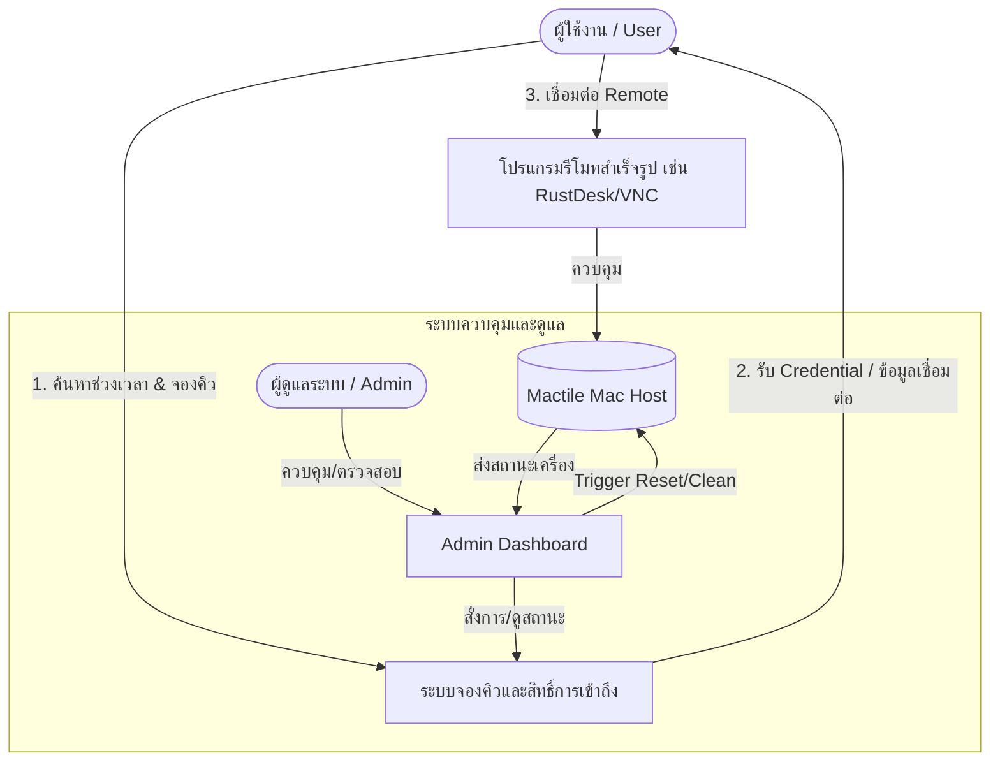

# เอกสารกฎบัตรโครงการ (Project Charter)
## โครงการ: Mactile (Minimum Viable Product - MVP)

---

### ข้อมูลทั่วไปของโครงการ (Project Overview)
- **ชื่อโครงการ:** Mactile
- **เวอร์ชัน:** 1.0.0 (MVP)
- **วันที่จัดทำ:** 16 สิงหาคม 2026
- **สถานะโครงการ:** กำลังเริ่มต้นพัฒนา (Initiation / MVP Phase)

---

### 1. ความเป็นมาและเหตุผล (Background & Rationale)
การจัดสรรทรัพยากรเครื่อง Mac สำหรับการพัฒนาและทดสอบระบบ (เช่น iOS/macOS Build, Cross-platform testing) มักประสบปัญหาเรื่องจำนวนเครื่องที่มีจำกัด การแย่งชิงการใช้งาน การบริหารจัดการสิทธิ์การเข้าถึง และความสะอาดของสภาพแวดล้อม (Environment State) หลังจากผู้ใช้คนก่อนหน้าใช้งานเสร็จ

**Mactile** ถูกพัฒนาขึ้นเป็นระบบบริหารจัดการเครื่อง Mac แบบรวมศูนย์ในรูปแบบ MVP เพื่อเปิดโอกาสให้ผู้ใช้งานสามารถจองคิว เข้าถึงเครื่องผ่านรีโมทคอนโทรล และมีระบบจัดการคืนสภาพแวดล้อมเครื่องแบบอัตโนมัติ/กึ่งอัตโนมัติ เพื่อรองรับผู้ใช้คนถัดไปได้อย่างปลอดภัยและมีประสิทธิภาพ

---

### 2. วัตถุประสงค์ของโครงการ (Project Objectives)
1. **จัดสรรการใช้งานอย่างเป็นธรรมและเป็นระเบียบ:** มีระบบจองคิวและจำกัดเวลาการใช้งานที่ชัดเจน ป้องกันการใช้งานทับซ้อน
2. **ลดภาระงานของผู้ดูแลระบบ (Admin):** มีระบบรีเซ็ตสภาพแวดล้อมเบื้องต้นเพื่อล้างข้อมูลและ Session ของผู้ใช้ก่อนหน้า
3. **เชื่อมต่อสะดวกรวดเร็วโดยไม่ต้องพัฒนาเครื่องมือ Remote ขึ้นใหม่:** ใช้ประโยชน์จากซอฟต์แวร์ Remote Desktop สำเร็จรูปที่มีมาตรฐานและความเสถียร
4. **ตรวจสอบและควบคุมได้แบบเรียลไทม์:** มีหน้า Dashboard สำหรับผู้ดูแลระบบเพื่อดูสถานะเครื่อง จัดการคิว และสั่งการทำงานต่างๆ

---

### 3. ขอบเขตโครงการ (Project Scope - MVP)

#### 3.1 ระบบจองคิวและการจัดการสิทธิ์การเข้าถึง (Queue Booking & Access Management)
- **การยืนยันตัวตน (Authentication):** รองรับการเข้าสู่ระบบของผู้ใช้งานและผู้ดูแลระบบ
- **การจองช่วงเวลา (Time-slot Booking):**
  - เลือกช่วงเวลาที่ต้องการใช้งาน (เช่น 1–2 ชั่วโมง/รอบ)
  - ป้องกันการจองซ้ำซ้อนในช่วงเวลาเดียวกัน (Conflict Prevention)
  - ระบบแจ้งเตือนก่อนหมดเวลาการใช้งาน (เช่น เตือนล่วงหน้า 5–10 นาที)
- **การออกสิทธิ์การเข้าถึง (Access Delegation):**
  - สร้างรหัสผ่านชั่วคราว (One-Time / Ephemeral Credential) หรือเปิดพอร์ต/เชื่อมสิทธิ์ตามช่วงเวลาการจอง
  - ตัดการเชื่อมต่อและปิดสิทธิ์อัตโนมัติเมื่อหมดเวลา

#### 3.2 ระบบจัดการและรีเซ็ตสภาพแวดล้อมเบื้องต้น (Environment Management & Basic Reset)
- **การเตรียมพร้อมเครื่อง (Pre-flight Setup):**
  - ตรวจสอบความพร้อมของเครื่องก่อนเปิดให้เริ่ม Session
- **การล้างข้อมูลและคืนสถานะเบื้องต้น (Basic Session Cleanup):**
  - ล็อกเอาต์บัญชีต่างๆ และ Kill Process ที่ค้างอยู่
  - ล้างโฟลเดอร์ชั่วคราว แคช และไฟล์ดาวน์โหลด (เช่น `~/Downloads`, `~/Desktop`, `/tmp`)
  - คืนค่าการตั้งค่าเบื้องต้นผ่าน Automation Script (เช่น Shell Script / macOS LaunchAgents)
- **การรีเซ็ตระดับฉุกเฉิน (Admin Manual/Forced Reset):**
  - ผู้ดูแลระบบสามารถกดสั่ง Restart หรือ Run Reset Script ได้ทันทีจาก Dashboard

#### 3.3 การเชื่อมต่อรีโมทด้วยโปรแกรมสำเร็จรูป (Remote Connection via Existing Software)
- **ซอฟต์แวร์รีโมทที่รองรับ:**
  - ซอฟต์แวร์ Remote Desktop มาตรฐาน (เช่น RustDesk, VNC / Apple Screen Sharing, AnyDesk, Chrome Remote Desktop หรือ SSH สำหรับ Command-Line)
- **การแจกจ่ายข้อมูลการเชื่อมต่อ:**
  - แสดง Hostname/IP, Port, Connection ID และรหัสผ่านที่หน้าเว็บระบบเมื่อถึงเวลาจอง
  - มีคู่มือขั้นตอนการเชื่อมต่อแบบทีละขั้นตอน (Step-by-Step Guide) ให้ผู้ใช้

#### 3.4 หน้า Dashboard สำหรับผู้ดูแลระบบ (Admin Dashboard)
- **ภาพรวมสถานะเครื่อง (Host Status Overview):**
  - แสดงสถานะของ Mac แต่ละเครื่อง: ว่าง (Available), กำลังใช้งาน (In-Use), ออฟไลน์ (Offline), กำลังบำรุงรักษา/รีเซ็ต (Maintenance/Resetting)
  - แสดงรายละเอียด Session ปัจจุบัน (ชื่อผู้ใช้, เวลาเริ่ม, เวลาคงเหลือ)
- **การจัดการคิวและตารางเวลา (Booking & Queue Management):**
  - ดูรายการจองล่วงหน้า ยกเลิก หรือแก้ไขสิทธิ์การจอง
- **ศูนย์ควบคุมการรีเซ็ตและสั่งการ (Reset & Command Actions):**
  - ปุ่มสั่ง Reset สภาพแวดล้อม / Reboot เครื่อง Mac
  - ปุ่มตัดการเชื่อมต่อผู้ใช้ทันที (Force Disconnect)
- **บันทึกประวัติการใช้งาน (System & Audit Logs):**
  - บันทึกประวัติการจอง การเข้าใช้งาน และประวัติการรีเซ็ตเครื่อง

---

### 4. ขอบเขตที่อยู่นอกเหนือ MVP (Out of Scope for MVP)
- ระบบ Virtualization เชิงลึกแบบ Nested macOS VM หลายเครื่องบน Mac เครื่องเดียว (ใน MVP ใช้โมเดล 1 Physical Host / 1 Session ณ ช่วงเวลาหนึ่ง)
- การคิดเงินและระบบ Payment Gateway
- การ Restore ระบบแบบ Snapshot Full Disk Image ย้อนกลับระดับ OS Snapshot (ใช้เป็น Script Cleanup ก่อนในระยะ MVP)

---

### 5. ความต้องการด้านเทคนิค (Technical Specifications)

| องค์ประกอบ | เทคโนโลยี / แนวทางที่แนะนำ |
|---|---|
| **Frontend Dashboard** | HTML / Modern JavaScript / Vanilla CSS (Clean & Responsive UI) |
| **Backend API / Service** | Node.js / Python / Go (สำหรับจัดการ Booking, State, และสั่ง Exec Script) |
| **Database** | SQLite / PostgreSQL สำหรับเก็บข้อมูลผู้ใช้ ตารางจอง และ Logs |
| **Host Automation** | macOS Shell Scripts (`zsh`/`bash`), AppleScript, Launchd |
| **Remote Tool** | RustDesk / VNC (Screen Sharing) / SSH |

---

### 6. แผนการดำเนินงานและเป้าหมาย (Milestones)

| ลำดับ | กิจกรรม / Milestone | ผลลัพธ์ที่คาดหวัง |
|:---:|---|---|
| **M1** | System Design & Architecture Finalization | เอกสารข้อกำหนดระบบและ Flow การทำงานสมบูรณ์ |
| **M2** | Core Booking System & DB | ระบบจองคิว ตรวจสอบเวลา และจัดการสิทธิ์ผู้ใช้ |
| **M3** | Remote Connection & Script Integration | ติดตั้งโปรแกรม Remote และทดสอบระบบเชื่อมต่อด้วยรหัสชั่วคราว |
| **M4** | Basic Environment Reset Automation | สคริปต์ล้างข้อมูล/คืนค่าหลังจบ Session ทำงานได้ถูกต้อง |
| **M5** | Admin Dashboard Development | หน้าเว็บแดชบอร์ดตรวจสอบสถานะและควบคุมเครื่องได้ |
| **M6** | End-to-End Testing & MVP Deployment | ทดสอบโฟลว์ครบวงจร (จอง -> รีโมท -> จบ -> รีเซ็ต) พร้อมใช้งาน |

---

### 7. ปัจจัยเสี่ยงและการรับมือ (Risks & Mitigation)

1. **ความเสี่ยง:** ผู้ใช้งานไม่ยอมตัดการเชื่อมต่อเมื่อหมดเวลา
   - **แนวทางแก้ไข:** ระบบจำกัดเวลาและสั่ง Terminate Session / เปลี่ยน Password หรือเตะการเชื่อมต่ออัตโนมัติผ่าน Script
2. **ความเสี่ยง:** ข้อมูลส่วนบุคคลหรือประวัติผู้ใช้คนก่อนหน้าหลงเหลือ
   - **แนวทางแก้ไข:** ออกแบบ Cleanup Script ให้ครอบคลุมทั้ง Keychain, Browsing Data, Shell History, และ User Files
3. **ความเสี่ยง:** ประสิทธิภาพและความหน่วงของการเชื่อมต่อ Remote Desktop
   - **แนวทางแก้ไข:** เลือกใช้โปรแกรมรีโมทที่มีประสิทธิภาพสูงบน LAN/Internet (เช่น RustDesk หรือ Native Apple Screen Sharing) พร้อมตั้งค่า Bandwidth / Resolution ที่เหมาะสม

---

### 8. เกณฑ์ความสำเร็จของโครงการ (Success Metrics / KPIs)
- ผู้ใช้งานสามารถจองคิวและได้รับข้อมูลเชื่อมต่อไปยังเครื่อง Mac ได้อย่างราบรื่นโดยไม่ต้องติดต่อผู้ดูแลระบบแบบ Manual
- ระบบสามารถคืนสภาพแวดล้อมเบื้องต้น (Clean state) ได้สำเร็จอย่างน้อย 95% ของการใช้งานทั้งหมด
- ผู้ดูแลระบบสามารถตรวจสอบสถานะและสั่งการรีเซ็ตเครื่องผ่าน Dashboard ได้แบบเรียลไทม์
- อัตราการเกิดข้อขัดแย้งในการจอง (Double Booking) เท่ากับ 0%
