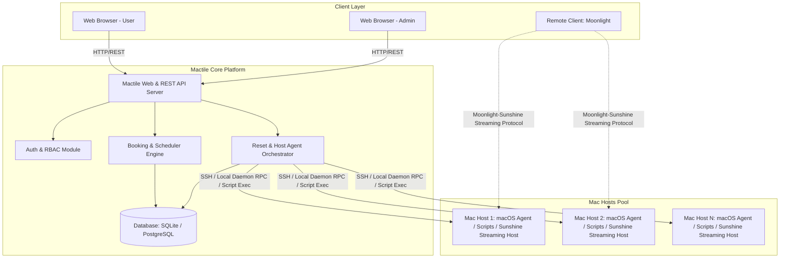
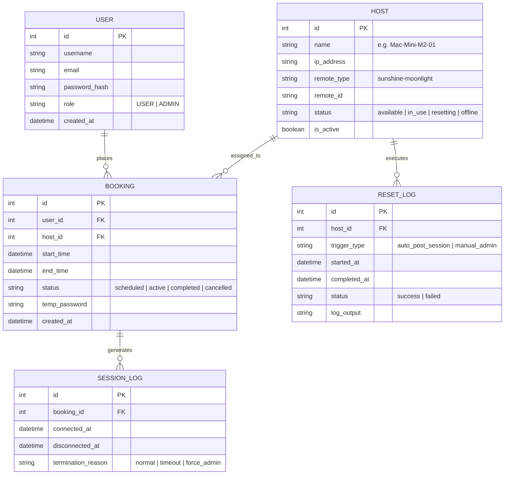
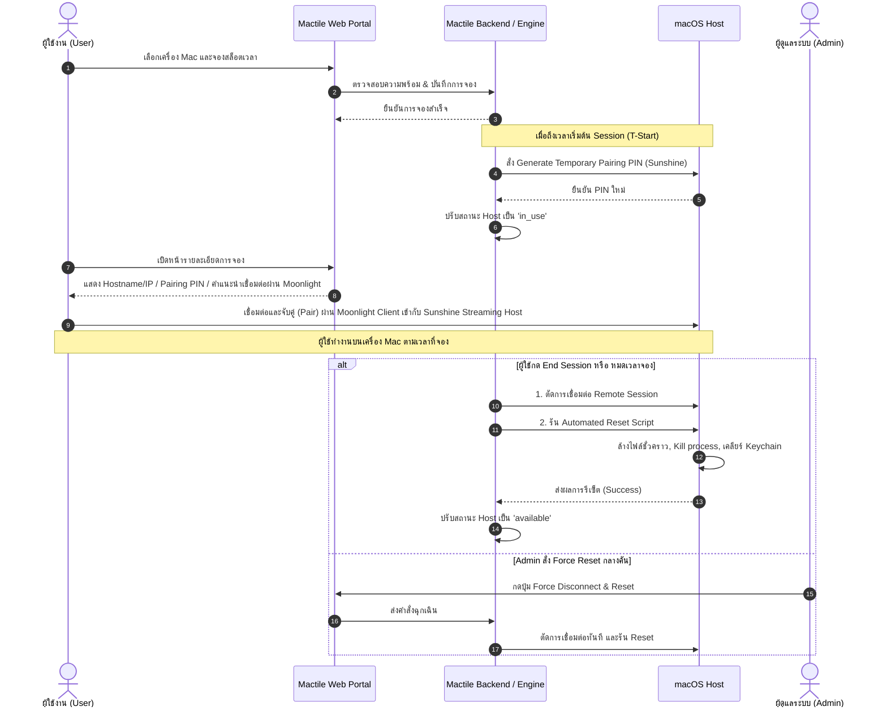

# เอกสารข้อกำหนดความต้องการของระบบ (Software Requirements Specification - SRS)
## โครงการ: Mactile
**เวอร์ชัน:** 1.0.0 (MVP)  
**วันที่จัดทำ:** 16 สิงหาคม 2026  
**สถานะ:** เอกสารข้อกำหนดความต้องการระบบฉบับสมบูรณ์ (Approved Baseline)

---

## สารบัญ (Table of Contents)
1. [บทนำ (Introduction)](#1-บทนำ-introduction)
2. [ภาพรวมของระบบและสถาปัตยกรรม (Overall Description)](#2-ภาพรวมของระบบและสถาปัตยกรรม-overall-description)
3. [ข้อกำหนดเชิงฟังก์ชัน (Functional Requirements - FR)](#3-ข้อกำหนดเชิงฟังก์ชัน-functional-requirements---fr)
   - [FR-1: การยืนยันตัวตนและการจัดการสิทธิ์ (Authentication & RBAC)](#fr-1-การยืนยันตัวตนและการจัดการสิทธิ์-authentication--rbac)
   - [FR-2: ระบบจองคิวและการเข้าถึง (Queue Booking & Access Management)](#fr-2-ระบบจองคิวและการเข้าถึง-queue-booking--access-management)
   - [FR-3: การจัดการและรีเซ็ตสภาพแวดล้อม (Environment Management & Reset)](#fr-3-การจัดการและรีเซ็ตสภาพแวดล้อม-environment-management--reset)
   - [FR-4: การเชื่อมต่อรีโมทด้วยโปรแกรมสำเร็จรูป (Remote Connection Gateway)](#fr-4-การเชื่อมต่อรีโมทด้วยโปรแกรมสำเร็จรูป-remote-connection-gateway)
   - [FR-5: แดชบอร์ดสำหรับผู้ดูแลระบบ (Admin Dashboard & Control Center)](#fr-5-แดชบอร์ดสำหรับผู้ดูแลระบบ-admin-dashboard--control-center)
4. [ข้อกำหนดที่ไม่ใช่เชิงฟังก์ชัน (Non-Functional Requirements - NFR)](#4-ข้อกำหนดที่ไม่ใช่เชิงฟังก์ชัน-non-functional-requirements---nfr)
5. [ข้อกำหนดส่วนต่อประสาน (Interface Requirements)](#5-ข้อกำหนดส่วนต่อประสาน-interface-requirements)
6. [แบบจำลองข้อมูล (Data Models & Entities)](#6-แบบจำลองข้อมูล-data-models--entities)
7. [แผนผังกระบวนการทำงานหลัก (System Workflows)](#7-แผนผังกระบวนการทำงานหลัก-system-workflows)

---

## 1. บทนำ (Introduction)

### 1.1 วัตถุประสงค์ของเอกสาร (Purpose)
เอกสารฉบับนี้จัดทำขึ้นเพื่อระบุข้อกำหนดทางเทคนิค ฟังก์ชันการทำงาน (Functional Requirements) และข้อกำหนดเชิงคุณภาพ (Non-Functional Requirements) สำหรับระบบ **Mactile** ในระยะ Minimum Viable Product (MVP) เพื่อใช้เป็นแนวทางอ้างอิงในการพัฒนา ทดสอบ และส่งมอบระบบ

### 1.2 ขอบเขตของระบบ (Scope)
**Mactile** เป็นระบบแพลตฟอร์มบริหารจัดการและจัดสรรทรัพยากรเครื่อง Mac ให้บริการแก่ผู้ใช้งานสำหรับการพัฒนาซอฟต์แวร์ การ Build และการทดสอบระบบ โดยครอบคลุมกระบวนการตั้งแต่การจองช่วงเวลา การออกสิทธิ์และข้อมูลการเชื่อมต่อรีโมท การเชื่อมต่อไปยังเครื่องเป้าหมายผ่านเครื่องมือสำเร็จรูป การตรวจสอบสถานะแบบเรียลไทม์ และระบบล้างสภาพแวดล้อม (Reset/Cleanup) อัตโนมัติหลังจบการใช้งาน

### 1.3 คำศัพท์และคำจำกัดความ (Definitions & Acronyms)
| คำศัพท์ / อักษรย่อ | ความหมาย |
|---|---|
| **Host / Mac Host** | เครื่องคอมพิวเตอร์ Mac (macOS) ที่เปิดให้บริการเชื่อมต่อ |
| **Session** | ช่วงระยะเวลาที่ผู้ใช้ได้รับสิทธิ์เชื่อมต่อและใช้งานเครื่อง Host |
| **Ephemeral Credential** | ข้อมูลการเข้าสู่ระบบแบบชั่วคราว (มีอายุการใช้งานจำกัดตามช่วงเวลาจอง) |
| **Sanitization / Reset** | กระบวนการล้างไฟล์ชั่วคราว ประวัติการใช้งาน และคืนค่าสถานะเครื่อง |
| **Remote Client** | โปรแกรม **Moonlight** ฝั่งผู้ใช้งานสำหรับรับสตรีมภาพและควบคุมหน้าจอ Mac Host ผ่านโปรโตคอล Game Streaming |
| **Streaming Host** | ซอฟต์แวร์ **Sunshine** ที่ติดตั้งบนเครื่อง Mac Host ทำหน้าที่เป็น Server สำหรับเข้ารหัสและส่งสตรีมภาพ/เสียงไปยัง Moonlight Client |
| **RBAC** | Role-Based Access Control (การควบคุมสิทธิ์ตามบทบาทผู้ใช้) |

---

## 2. ภาพรวมของระบบและสถาปัตยกรรม (Overall Description)

### 2.1 มุมมองและบทบาทผู้ใช้งาน (User Classes & Roles)
1. **User (ผู้ใช้งานทั่วไป / นักพัฒนา):**
   - ค้นหาตารางเวลาว่างของเครื่อง Mac
   - จองคิวและยกเลิกการจองของตนเอง
   - รับ Credential และคำแนะนำการเชื่อมต่อ Remote
   - รันการทดสอบ/Build งานบนเครื่อง Mac ภายในช่วงเวลาที่ได้รับอนุญาต
2. **Administrator (ผู้ดูแลระบบ):**
   - ตรวจสอบสถานะ Live Status ของเครื่อง Mac ทุกเครื่อง
   - จัดการตารางจอง คิว และยกเลิกการจองของผู้ใช้ (Admin Override)
   - สั่ง Force Disconnect, Restart หรือ Run Reset Script แบบ Manual
   - ดูประวัติการใช้งาน (Audit Logs) และจัดการข้อมูลเครื่อง Host

### 2.2 แผนผังสถาปัตยกรรมระบบ (Architecture Overview)

---

## 3. ข้อกำหนดเชิงฟังก์ชัน (Functional Requirements - FR)

### FR-1: การยืนยันตัวตนและการจัดการสิทธิ์ (Authentication & RBAC)
- **FR-1.1:** ระบบต้องรองรับการลงทะเบียนและเข้าสู่ระบบด้วย Username/Email และ Password
- **FR-1.2:** ระบบต้องแบ่งสิทธิ์ผู้ใช้งานอย่างน้อย 2 ระดับ: `USER` และ `ADMIN`
- **FR-1.3:** ระบบต้องรักษาความปลอดภัยของ Session การล็อกอินด้วย JWT (JSON Web Token) หรือ Secure Session Cookie
- **FR-1.4:** ระบบต้องป้องกันไม่ให้ผู้ใช้ระดับ `USER` เข้าถึงหน้าและ API ของผู้ดูแลระบบ

---

### FR-2: ระบบจองคิวและการเข้าถึง (Queue Booking & Access Management)
- **FR-2.1 ตารางเวลาการจอง (Calendar / Slot View):**
  - แสดงตารางช่วงเวลาว่างและไม่ว่างของแต่ละ Host อย่างชัดเจน
  - กำหนดขนาดช่วงเวลามาตรฐาน เช่น สล็อตละ 30 นาที, 1 ชั่วโมง หรือ 2 ชั่วโมง
- **FR-2.2 การสร้างการจอง (Booking Creation & Validation):**
  - ผู้ใช้สามารถเลือกเครื่อง Host และช่วงเวลาที่ต้องการจองได้
  - ระบบต้องตรวจสอบความซ้ำซ้อนของเวลา (Conflict Detection) แบบ Atomic ป้องกันการเกิด Double-Booking
  - จำกัดสิทธิ์การจองล่วงหน้าต่อผู้ใช้ (เช่น จองล่วงหน้าได้ไม่เกิน 2 สล็อตพร้อมกัน)
- **FR-2.3 การออกรหัสผ่านและสิทธิ์การเข้าถึง (Credential Provisioning):**
  - ก่อนเริ่ม Session เล็กน้อย (เช่น 2 นาทีก่อนถึงเวลา) ระบบจะสร้างรหัสผ่านการเชื่อมต่อแบบชั่วคราว (One-Time / Ephemeral Password) สำหรับ Remote Daemon บนเครื่อง Host
  - แสดงข้อมูลการเชื่อมต่อ (IP/Domain, Port, Remote ID, Password) ให้ผู้ใช้เห็นเฉพาะในช่วงเวลาที่ได้รับสิทธิ์
- **FR-2.4 การนับถอยหลังและการแจ้งเตือนหมดเวลา (Time Warning & Expiry):**
  - แสดงเวลานับถอยหลัง (Countdown Timer) บนหน้า Web Portal
  - ส่งการแจ้งเตือนเตือนล่วงหน้า 5 นาทีก่อนหมดเวลา
  - เมื่อหมดเวลา ระบบจะตัดสิทธิ์การเข้าถึงและยกเลิก Credential โดยอัตโนมัติ

---

### FR-3: การจัดการและรีเซ็ตสภาพแวดล้อม (Environment Management & Reset)
- **FR-3.1 การตรวจสอบความพร้อม (Pre-flight Readiness Check):**
  - ตรวจสอบสถานะการเชื่อมต่อเครือข่าย, Remote Daemon และพื้นที่ว่างบนดิสก์ก่อนเปิดสล็อตให้ผู้ใช้เชื่อมต่อ
- **FR-3.2 การล้างข้อมูลอัตโนมัติหลังจบ Session (Post-Session Automated Reset):**
  - เมื่อ Session หมดเวลาหรือผู้ใช้กดยืนยันสิ้นสุดการใช้งาน (End Session Early):
    1. ทำการ Terminate และเตะการเชื่อมต่อรีโมททั้งหมด
    2. ทำการ Kill User-level Processes ที่ตกค้าง (เช่น Xcode, Simulators, Node, Docker, Browsers)
    3. ลบไฟล์และแคชในไดเรกทอรีชั่วคราว (`~/Desktop/*`, `~/Downloads/*`, `/tmp/*`, `~/.Trash/*`)
    4. ล้าง Git Credentials, Shell History (`~/.zsh_history`) และ Browser Data/Cookies
    5. เปลี่ยนรหัสผ่าน Remote Service สำหรับ Session ถัดไป
- **FR-3.3 คำสั่งรีเซ็ตฉุกเฉิน (Admin Force Reset & Reboot):**
  - ผู้ดูแลระบบสามารถกดปุ่มสั่ง Execute Reset Script ทันทีจากหน้า Dashboard
  - ผู้ดูแลระบบสามารถสั่งคำสั่ง Reboot เครื่อง Mac จากระยะไกลได้กรณีระบบค้างหรือไม่ตอบสนอง

---

### FR-4: การเชื่อมต่อรีโมทด้วยระบบ Game Streaming (Remote Connection Gateway)
- **FR-4.1 การใช้งานร่วมกับระบบ Game Streaming Moonlight/Sunshine:**
  - ประยุกต์ใช้ **Sunshine** เป็น Self-hosted Game Stream Host ติดตั้งบนเครื่อง Mac Host แต่ละเครื่อง ทำหน้าที่ Capture หน้าจอและเข้ารหัสสตรีมภาพ/เสียงแบบ Low-Latency (รองรับ Hardware Encoding)
  - ผู้ใช้เชื่อมต่อผ่านโปรแกรม **Moonlight** (มีให้ใช้งานบน Windows, macOS, Linux, iOS/Android และ Web Client) โดยไม่ต้องติดตั้ง Custom Remote Client เฉพาะทาง สามารถดาวน์โหลด Moonlight มาตรฐานได้ทันที
  - รองรับการทำ Command-Line/Build Tasks ผ่าน Terminal ที่เปิดใช้งานภายในหน้าจอที่ Stream มา แทนการเปิด SSH แยกต่างหาก
- **FR-4.2 หน้าแนะนำการเชื่อมต่อ (Quick Launch & Instruction Modal):**
  - มีปุ่ม "Copy Connection Info" (Hostname/IP และ PIN Pairing Code)
  - มีขั้นตอนการจับคู่ (Pairing) ระหว่าง Moonlight Client กับ Sunshine Host ด้วย PIN แบบ One-Time ที่หน้าเว็บระบบ
  - มีคำแนะนำการติดตั้ง Moonlight และการตั้งค่าเบื้องต้น (Resolution, Bitrate, FPS) ให้ผู้ใช้

---

### FR-5: แดชบอร์ดสำหรับผู้ดูแลระบบ (Admin Dashboard & Control Center)
- **FR-5.1 ภาพรวมสถานะเครื่อง (Live Host Matrix):**
  - แสดงการ์ดสถานะของ Mac แต่ละเครื่องแบบ Real-time พร้อม Color-coded Badges:
    - 🟢 **Available (ว่าง):** พร้อมให้จอง/ใช้งาน
    - 🟡 **In-Use (กำลังใช้งาน):** มีผู้ใช้กำลังเชื่อมต่อ พร้อมแสดงชื่อผู้ใช้และเวลาคงเหลือ
    - 🟠 **Resetting (กำลังคืนค่า):** กำลังดำเนินการรันสคริปต์ Cleanup
    - 🔴 **Offline / Maintenance (ออฟไลน์/ปิดปรับปรุง):** ไม่พร้อมให้บริการ
- **FR-5.2 การควบคุมและจัดการคิว (Session & Queue Management):**
  - ดูรายการจองทั้งหมดในระบบทั้ง อดีต, ปัจจุบัน, และอนาคต
  - ปุ่ม **Force Disconnect** เพื่อตัดการเชื่อมต่อผู้ใช้ปัจจุบันทันที
  - ปุ่ม **Cancel Booking** เพื่อยกเลิกคิวที่ผู้ใช้จองไว้ในกรณีฉุกเฉิน
- **FR-5.3 การจัดการอุปกรณ์เครื่อง Mac (Host Management):**
  - เพิ่ม แก้ไข หรือปิดการใช้งาน (Enable/Disable) เครื่อง Host ในระบบ
  - กำหนด IP, Streaming Parameters (Sunshine Port, Pairing PIN) และพารามิเตอร์ของ Host
- **FR-5.4 บันทึกประวัติและสถิติ (Audit Logs & Reports):**
  - บันทึก Log การจอง, เวลาเริ่ม-สิ้นสุดจริง, ผลการทำงานของ Reset Script, และการสั่งการของ Admin
  - บันทึกข้อผิดพลาด (Failure Logs) หากสคริปต์รีเซ็ตทำงานไม่สำเร็จ

---

## 4. ข้อกำหนดที่ไม่ใช่เชิงฟังก์ชัน (Non-Functional Requirements - NFR)

| หมวดหมู่ | รหัส | ข้อกำหนดเชิงคุณภาพ | เกณฑ์การวัดผล |
|---|---|---|---|
| **ความปลอดภัย (Security)** | NFR-S1 | การจัดเก็บรหัสผ่าน | รหัสผ่านผู้ใช้ต้องถูกเข้ารหัสด้วย Bcrypt/Argon2 |
| | NFR-S2 | การเข้าถึงชั่วคราว | รหัส Remote Password ต้องมีอายุจำกัดและถูกสับเปลี่ยนทุก Session |
| | NFR-S3 | ความเป็นส่วนตัวของข้อมูล | ข้อมูลและประวัติการทำงานของผู้ใช้คนก่อนหน้าต้องถูกลบหมดจด ไม่หลงเหลือให้ผู้ใช้คนถัดไปเข้าถึงได้ |
| **ประสิทธิภาพ (Performance)** | NFR-P1 | เวลาในการรีเซ็ตเครื่อง | สคริปต์ Basic Reset ต้องทำงานเสร็จสิ้นภายในเวลาไม่เกิน 60 วินาที |
| | NFR-P2 | การตอบสนองของระบบเว็บ | หน้า Dashboard และ Booking Portal ต้องตอบสนอง (Response Time) ภายใน 500ms บนเครือข่ายปกติ |
| **ความเสถียร (Reliability)** | NFR-R1 | ป้องกันการจองชนกัน | อัตราความผิดพลาดจากการจองเวลาซ้ำ (Double Booking) ต้องเป็น 0% |
| | NFR-R2 | การกู้คืนสถานะ | หากการรีเซ็ตล้มเหลว ระบบต้องเปลี่ยนสถานะเครื่องเป็น `Maintenance` โดยอัตโนมัติและแจ้งเตือน Admin |
| **ความง่ายในการใช้งาน (Usability)** | NFR-U1 | ความสะดวกในการเชื่อมต่อ | ผู้ใช้ต้องสามารถเข้าถึงข้อมูลการเชื่อมต่อได้ในไม่เกิน 2 คลิกหลังถึงเวลาจอง |
| | NFR-U2 | การแสดงผลที่รองรับทุกหน้าจอ | ระบบเว็บ Dashboard และ Booking ต้องรองรับ Responsive บน Desktop และ Mobile Browser |

---

## 5. ข้อกำหนดส่วนต่อประสาน (Interface Requirements)

### 5.1 ส่วนต่อประสานผู้ใช้ (User Interfaces)
- **UI-1 (User Booking View):** หน้าเลือกดูเครื่อง Mac, ตารางปฏิทินแสดง Slot, ปุ่มกดยืนยันการจอง, และหน้ารายการ "My Bookings"
- **UI-2 (Active Session Modal):** ป๊อปอัปแสดงเมื่อถึงเวลาใช้งาน แสดง Countdown Timer, ข้อมูล Remote Host, Pairing PIN สำหรับ Moonlight, และปุ่ม "End Session"
- **UI-3 (Admin Dashboard View):** แดชบอร์ดสรุปสถิติ, Live Host Status Cards พร้อม Action Buttons (Reset, Reboot, Kick), และตารางจัดการ Booking ทั้งหมด

### 5.2 ส่วนต่อประสานฮาร์ดแวร์และระบบปฏิบัติการ (macOS Host Interfaces)
- คำสั่งควบคุมรันผ่าน **macOS Local Agent / SSH Service / Launchd Scripts**
- สิทธิ์การรัน Script รีเซ็ตต้องได้รับสิทธิ์ `sudo` แบบ NOPASSWD สำหรับ Script เฉพาะทางที่กำหนด เพื่อความปลอดภัย

### 5.3 ส่วนต่อประสานซอฟต์แวร์ภายนอก (Software Interfaces)
- **Remote Streaming Daemons:**
  - Sunshine Service (Self-hosted Game Stream Host — ติดตั้งบน Mac Host แต่ละเครื่อง รองรับการกำหนด Pairing PIN ผ่าน Web UI/API ของ Sunshine เอง)
  - Moonlight Client (โปรแกรมฝั่งผู้ใช้งาน เชื่อมต่อผ่านโปรโตคอล NVIDIA GameStream-compatible ของ Sunshine)
  - macOS Native Remote Management (`kickstart` / SSH) สำหรับงานดูแลระบบเบื้องหลังเท่านั้น ไม่ใช่ช่องทางหลักที่ผู้ใช้ปลายทางใช้เชื่อมต่อ

---

## 6. แบบจำลองข้อมูล (Data Models & Entities)

---

## 7. แผนผังกระบวนการทำงานหลัก (System Workflows)

### 7.1 กระบวนการจองและเข้าใช้งาน (End-to-End User Journey)

---

## 8. ภาคผนวกและเกณฑ์การตรวจรับระบบ (Acceptance Criteria)

1. **การทดสอบการจอง (Booking Validation):**
   - ผู้ใช้ 2 คนไม่สามารถจองเครื่องเดียวกันในช่วงเวลาทับซ้อนกันได้
2. **การออก Credential ชั่วคราว (Ephemeral Access):**
   - รหัสผ่านเข้าเครื่อง Mac ใช้งานได้เฉพาะช่วงเวลาที่จอง และไม่สามารถใช้รหัสเดิมเชื่อมต่อหลังจบ Session ได้
3. **การทำงานของสคริปต์คืนสภาพแวดล้อม (Reset Verification):**
   - หลังจบรอบการใช้งาน ไฟล์ทดสอบที่สร้างไว้บน `~/Desktop` และ `~/Downloads` รวมถึง Process ที่เปิดค้างไว้ จะต้องถูกกำจัดทั้งหมด
4. **ความสมบูรณ์ของ Admin Dashboard:**
   - ผู้ดูแลระบบสามารถเห็นสถานะเรียลไทม์ของทุก Host และสามารถกดสั่ง Disconnect / Reset ได้ตามที่กำหนด
